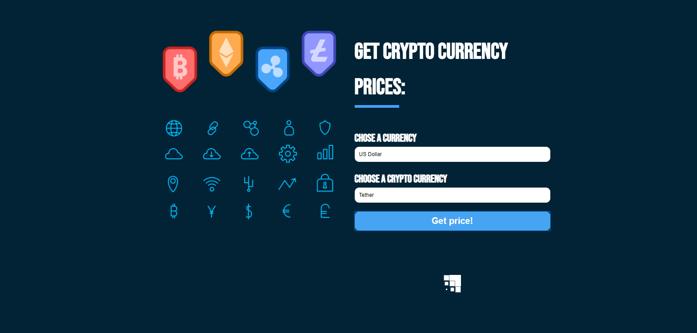

Get the cost of different crypto currencies

Used the API from https://min-api.cryptocompare.com/

Used Styled Components

Used Custom Hooks

The site is deployed in Netlify: https://ecstatic-jang-e813f7.netlify.com/

Some imgs of the site:

Showing a quotation:

Added a spinner:

Made with ❤️ by Antonio Salazar

😗
